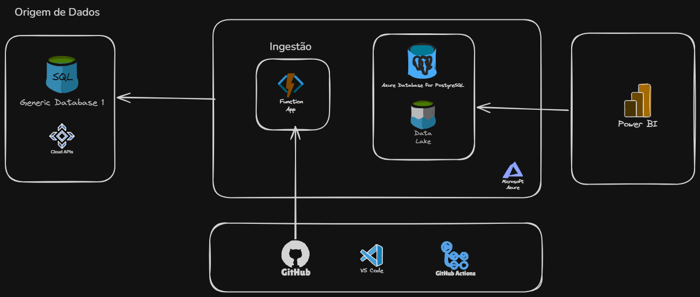

# ☁️ Arquitetura de Dados em Azure

## 🏗️ Arquitetura da solução

A solução foi desenvolvida utilizando serviços da Microsoft Azure para
realizar a ingestão, armazenamento, processamento e visualização dos dados.

### Fluxo da solução

**Fontes de Dados → Azure Function → Data Lake / PostgreSQL → Power BI**

O processo de desenvolvimento e implantação é automatizado utilizando:

**GitHub → GitHub Actions → Azure**
